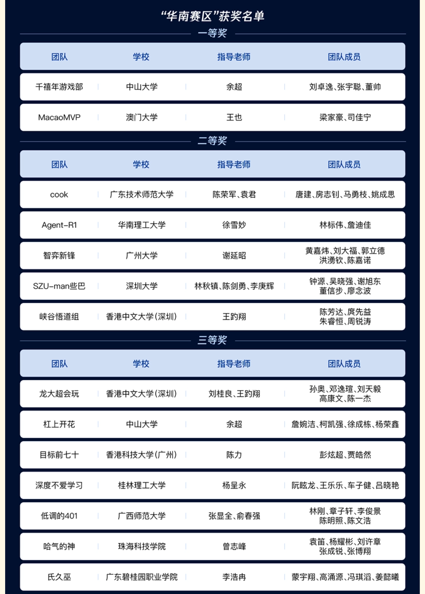

<p align="center">
  
</p>

<div align="center">

# 董信步 ｜ XB-Dong

**全栈开发者 / AI 工程实践者 / 优化算法研究参与者**

把实时系统、业务闭环和 AI 能力揉进可运行的产品里。  
目前更关注：**直播竞拍、实时协同、后端可靠性、AI 辅助业务系统**。

[GitHub](https://github.com/XB-Dong) · [Google Scholar](https://scholar.google.com/citations?hl=zh-CN&user=4w56hlIAAAAJ) · [LLM-NHO](https://github.com/TIO-Team/LLM-NHO)

</div>

---

## 墨迹所至，先写工程

我喜欢把项目做成“能跑、能查、能扩展”的完整系统，而不是只停在页面或接口。  
在全栈项目里，我更在意三件事：

- **业务链路闭环**：从创建拍品、进入直播间、实时出价、裁决胜者到订单结算，流程要完整。
- **实时状态可靠**：高频出价、倒计时、排行、重连恢复都不能只靠前端“看起来像实时”。
- **AI 能力贴近场景**：让语义检索、推荐、辅助搜索服务于真实业务，而不是做孤立演示。

---

## 主轴项目：全栈直播竞拍平台

### [ByteDanceliveauctioni](https://github.com/Ye-yellow/ByteDanceliveauctioni)

我作为合作者参与的全栈直播电商竞拍项目。项目覆盖 **Go 后端、PC 商家控制台、移动端 H5 买家端、实时竞价链路、订单结算和 AI 辅助能力**。

| 模块 | 我想突出的能力 |
| --- | --- |
| 后端服务 | `Go` 构建竞拍 API，承接拍品、会场、出价、结算等核心链路 |
| 实时竞价 | `WebSocket` 推送价格、排行、倒计时、成交等事件，支持重连后的状态恢复 |
| 热状态裁决 | `Redis` 承载竞拍运行态，使用 `Lua` 做原子出价决策 |
| 业务落库 | `MySQL` 保存订单、成交、支付状态等可审计事实 |
| 商家端 | `React` + `TypeScript` + `Vite` 搭建 PC 经营控制台 |
| 买家端 | 移动端 H5 直播间，覆盖看拍品、出价、接收实时结果 |
| AI 辅助 | 通过 Embedding 与向量检索支持语义搜索和推荐 |
| 可观测性 | 接入 `Prometheus` / `Grafana` 观察服务状态与业务指标 |

> 这不是一个单点功能演示，而是一条完整的竞拍业务河流：商家开拍，买家出价，后端裁决，实时同步，最终结算。

---

## 技术栈

### 后端与基础设施

`Go` · `RESTful API` · `WebSocket` · `Redis` · `Lua` · `MySQL` · `PostgreSQL / pgvector` · `Docker` · `Prometheus` · `Grafana`

### 前端与产品界面

`React` · `TypeScript` · `Vite` · `H5` · 商家控制台 · 移动端直播间 · 数据看板

### AI 与算法

`Embedding` · 向量检索 · 语义搜索 · 推荐 · `PyTorch` · 大规模路径优化 · `TSP / CVRP`

---

## 研究与开源

### [LLM-NHO](https://github.com/TIO-Team/LLM-NHO)

参与导师一作、学生二作的 `TEVC` 论文代码仓库：**Large Language Model-Driven Neural-Heuristic Optimization for Large-Scale Routing Problems**。  
方向聚焦 `LLM` 驱动的神经启发式优化，用于 `TSP` 与 `CVRP` 等大规模路径问题。

### 简历模板开源

- [Chinese-Resume-Template-of-SZU](https://github.com/XB-Dong/Chinese-Resume-Template-of-SZU)：深圳大学中文简历 `Overleaf` 模板。
- [SZU-Job-Resume](https://github.com/XB-Dong/SZU-Job-Resume)：面向求职场景的 `Overleaf` 简历模板。

---

## 竞赛与荣誉

**人工智能挑战赛 - 智能体决策算法高级赛道区域赛，华南赛区二等奖**

<p align="center">
  
</p>

---

## 我能交付的系统气质

```text
业务理解       从场景出发，把竞拍、订单、结算、运营指标串成闭环
后端可靠性     用状态机、原子操作、事实落库守住关键路径
实时体验       用 WebSocket 和快照恢复让前后端状态保持一致
前端工程       用 React / TypeScript 构建可操作、可观测、可复用的界面
AI 落地        把语义检索、推荐和大模型能力嵌入实际业务流程
```

---

## 目前关注

- 打磨更完整的全栈系统设计能力：从接口、状态、数据到可观测性。
- 探索 AI 在交易、搜索、推荐、决策辅助中的工程落地。
- 将算法研究中的优化思想迁移到真实业务系统里。

---

<div align="center">

**山水有留白，代码要闭环。**  
欢迎交流全栈开发、AI 工程、实时系统与优化算法。

</div>
